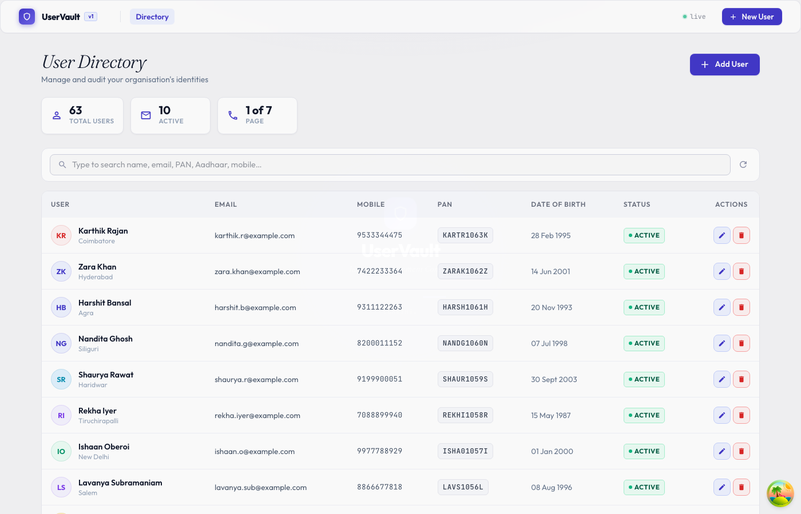
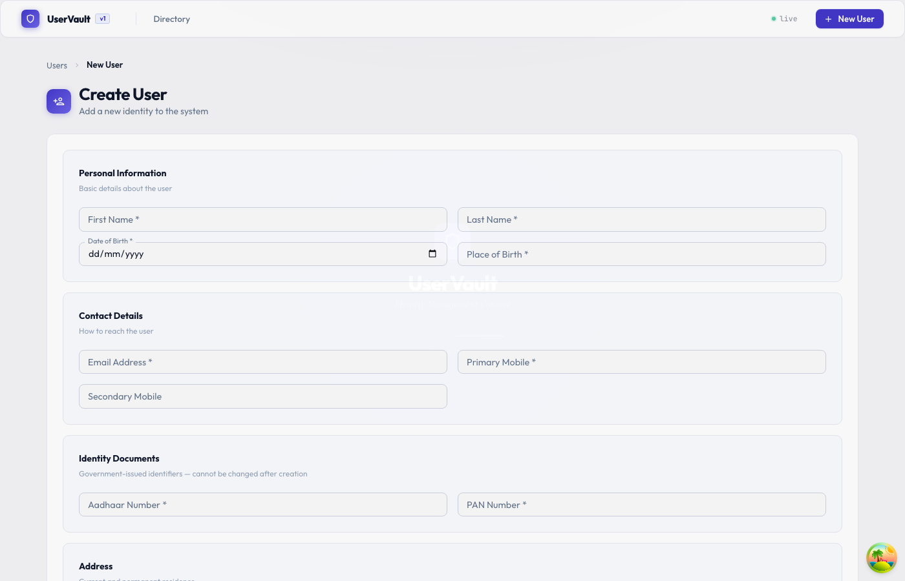

<div align="center">

# UserVault

Full-stack User Management System — NestJS · Prisma · MySQL · React

</div>

---



<table>
<tr>
<td></td>
</tr>
</table>

---

## Stack

`NestJS` `Prisma` `MySQL 8` `React 18` `Material UI` `TypeScript` `Docker`

---

## Run locally

**Docker (one command)**

```bash
cp backend/.env.example backend/.env
docker-compose up -d
docker-compose exec backend npm run prisma:seed
```

| | URL |
|--|--|
| App | http://localhost:3000 |
| API | http://localhost:3001/api/v1 |
| Docs | http://localhost:3001/api/docs |

**Without Docker**

```bash
# 1. start mysql
docker-compose up mysql -d

# 2. backend
cd backend && cp .env.example .env
npm install && npx prisma migrate dev && npm run start:dev

# 3. frontend (new terminal)
cd frontend && npm install && npm run dev
```

---

## API

| Method | Endpoint | |
|--------|----------|-|
| `POST` | `/api/v1/users` | Create |
| `GET` | `/api/v1/users` | List (paginated) |
| `GET` | `/api/v1/users/search?q=` | Search |
| `GET` | `/api/v1/users/:id` | Get |
| `PUT` | `/api/v1/users/:id` | Update |
| `DELETE` | `/api/v1/users/:id` | Soft-delete |
| `GET` | `/api/v1/users/:id/audit-logs` | Audit trail |

---

## Tests

```bash
cd backend
npm run test        # unit
npm run test:e2e    # integration
```
